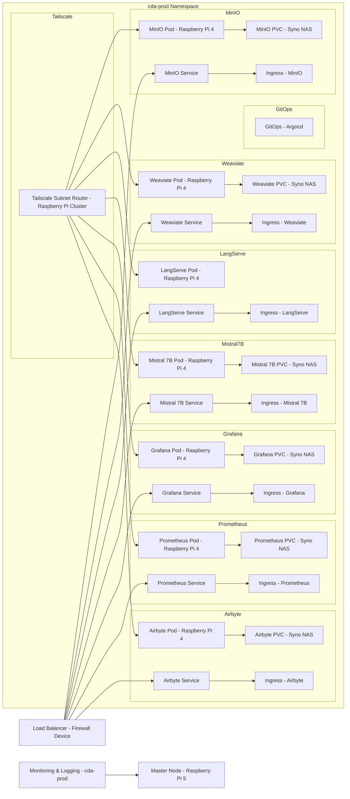

```mermaid
graph LR
    master[Master Node - Raspberry Pi 5]

    subgraph "cda-prod Namespace"
        subgraph MinIO
            minioPod[MinIO Pod - Raspberry Pi 4]
            minioService[MinIO Service]
            minioPVC[MinIO PVC - Syno NAS]
            minioIngress[Ingress - MinIO]
            minioPod --> minioPVC
            minioService --> minioIngress
        end

        subgraph Weaviate
            weaviatePod[Weaviate Pod - Raspberry Pi 4]
            weaviateService[Weaviate Service]
            weaviatePVC[Weaviate PVC - Syno NAS]
            weaviateIngress[Ingress - Weaviate]
            weaviatePod --> weaviatePVC
            weaviateService --> weaviateIngress
        end

        subgraph LangServe
            langservePod[LangServe Pod - Raspberry Pi 4]
            langserveService[LangServe Service]
            langserveIngress[Ingress - LangServe]
            langserveService --> langserveIngress
        end

        subgraph Mistral7B
            mistralPod[Mistral 7B Pod - Raspberry Pi 4]
            mistralService[Mistral 7B Service]
            mistralPVC[Mistral 7B PVC - Syno NAS]
            mistralIngress[Ingress - Mistral 7B]
            mistralPod --> mistralPVC
            mistralService --> mistralIngress
        end

        subgraph Grafana
            grafanaPod[Grafana Pod - Raspberry Pi 4]
            grafanaService[Grafana Service]
            grafanaPVC[Grafana PVC - Syno NAS]
            grafanaIngress[Ingress - Grafana]
            grafanaPod --> grafanaPVC
            grafanaService --> grafanaIngress
        end

        subgraph Prometheus
            prometheusPod[Prometheus Pod - Raspberry Pi 4]
            prometheusService[Prometheus Service]
            prometheusPVC[Prometheus PVC - Syno NAS]
            prometheusIngress[Ingress - Prometheus]
            prometheusPod --> prometheusPVC
            prometheusService --> prometheusIngress
        end

        subgraph GitOps
            gitOps[GitOps - Argocd]
        end

        subgraph Airbyte
            airbytePod[Airbyte Pod - Raspberry Pi 4]
            airbyteService[Airbyte Service]
            airbytePVC[Airbyte PVC - Syno NAS]
            airbyteIngress[Ingress - Airbyte]
            airbytePod --> airbytePVC
            airbyteService --> airbyteIngress
        end

        subgraph Tailscale
            tailscaleSubnetRouter[Tailscale Subnet Router - Raspberry Pi Cluster]
            tailscaleSubnetRouter --> minioPod
            tailscaleSubnetRouter --> weaviatePod
            tailscaleSubnetRouter --> langservePod
            tailscaleSubnetRouter --> mistralPod
            tailscaleSubnetRouter --> grafanaPod
            tailscaleSubnetRouter --> prometheusPod
            tailscaleSubnetRouter --> airbytePod
        end
    end

    loadBalancer[Load Balancer - Firewall Device]
    loadBalancer --> minioService
    loadBalancer --> weaviateService
    loadBalancer --> langserveService
    loadBalancer --> mistralService
    loadBalancer --> grafanaService
    loadBalancer --> prometheusService
    loadBalancer --> airbyteService

    monitoring[Monitoring & Logging - cda-prod]
    monitoring --> master
``` 